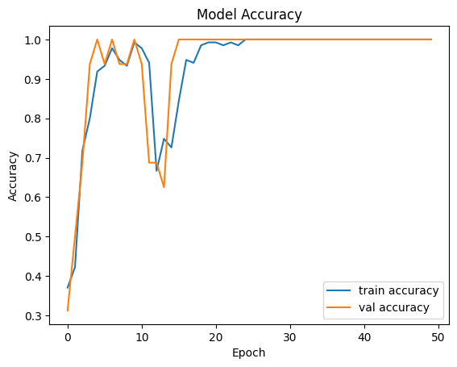
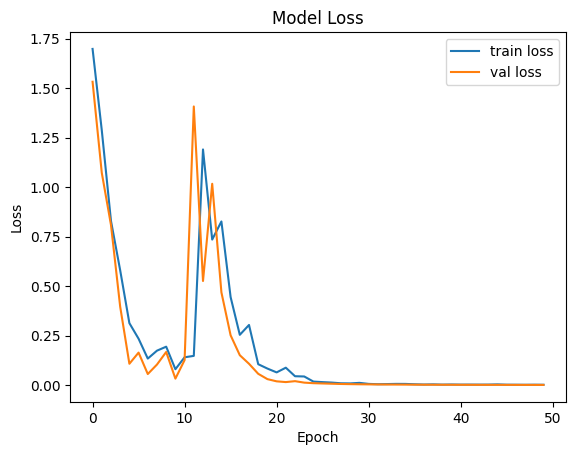

# mediapipe-lstm-gesture-control

Real-time hand gesture recognition system for controlling a media player using MediaPipe and LSTM (work in progress).

## Hand Gesture Media Player Control

This project is currently under development.

This project aims to control a media player using hand gestures detected from a webcam.  
Hand landmarks will be extracted using MediaPipe, and gestures will be classified using an LSTM model.

The goal is to build a real-time gesture recognition system that allows users to control media playback without using a keyboard or mouse.

---

Bu proje şu anda geliştirme aşamasındadır.

Bu proje, kameradan alınan görüntülerdeki el hareketlerini algılayarak bir medya oynatıcıyı kontrol etmeyi amaçlamaktadır.  
El landmarkları MediaPipe kullanılarak çıkarılacak ve dinamik el hareketleri LSTM tabanlı bir model ile sınıflandırılacaktır.

Amaç, kullanıcıların klavye veya fare kullanmadan medya oynatıcıyı el hareketleriyle kontrol edebileceği gerçek zamanlı bir sistem geliştirmektir.

---

## 🚀 Current Progress / Mevcut İlerleme

The project is actively under development. Since the initial version, significant progress has been made.

- Hand landmark extraction implemented using MediaPipe  
- Dataset created and organized  
- An initial LSTM model has been successfully trained  
- Model performance has been evaluated  

---

Proje aktif olarak geliştirilmeye devam etmektedir. İlk versiyondan bu yana önemli ilerlemeler kaydedilmiştir.

- MediaPipe ile el landmark çıkarımı gerçekleştirildi  
- Veri seti oluşturuldu ve düzenlendi  
- İlk LSTM modeli başarıyla eğitildi  
- Model performansı analiz edildi  

---

## 📊 Model Results / Model Sonuçları

### Accuracy Graph

### Loss Graph

### Confusion Matrix

---

## 🔄 Status

This project is under active development and will continue to evolve.  
Proje aktif olarak geliştirilmeye devam etmektedir.