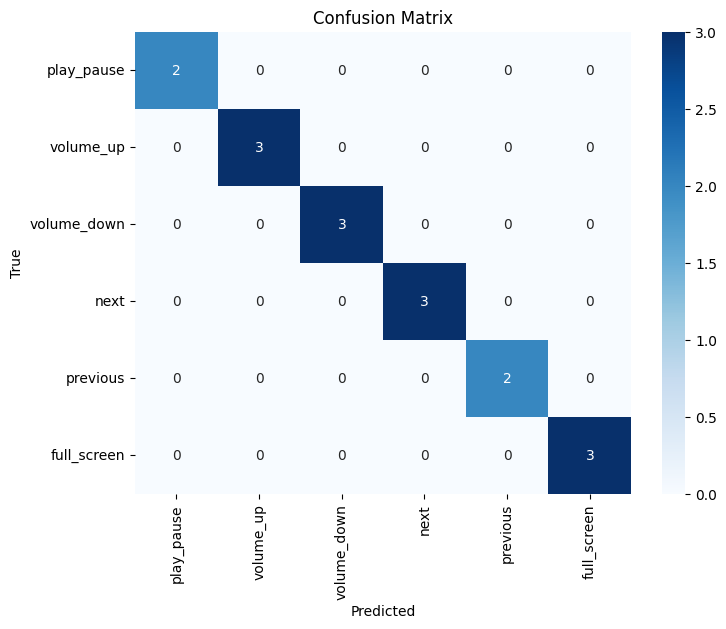

# Version 1 (v1) - Initial Model

## Description

This version represents the first trained LSTM model of the project.

For this stage, a dataset was created containing **25 samples for each gesture class**.  
The dataset consists of hand landmark sequences extracted using MediaPipe.

The model was trained using this initial dataset to evaluate the feasibility of gesture classification.

### Key Points

- Dataset includes 25 samples per class  
- Hand landmarks extracted using MediaPipe  
- Initial LSTM model trained  
- Model performance evaluated with basic metrics  

---

## Açıklama

Bu versiyon, projenin ilk eğitilmiş LSTM modelini temsil etmektedir.

Bu aşamada, her bir hareket sınıfı için **25 örnek içeren bir veri seti oluşturulmuştur**.  
Veri seti, MediaPipe kullanılarak çıkarılan el landmark dizilerinden oluşmaktadır.

Model, bu başlangıç veri seti ile eğitilerek hareket sınıflandırmasının uygulanabilirliği test edilmiştir.

### Öne Çıkanlar

- Her sınıf için 25 örnek içeren veri seti  
- MediaPipe ile el landmark çıkarımı  
- İlk LSTM model eğitimi  
- Temel performans değerlendirmesi yapılmıştır  

## 📊 Results

