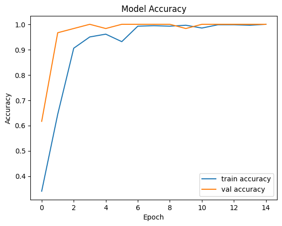
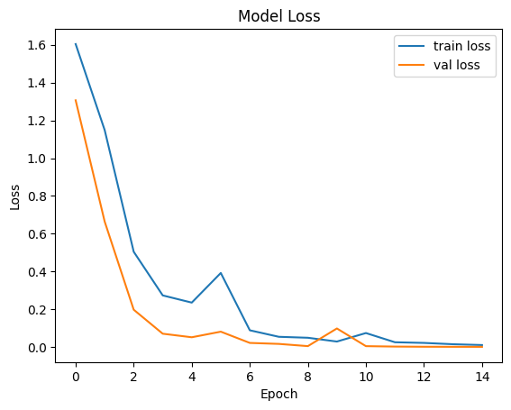
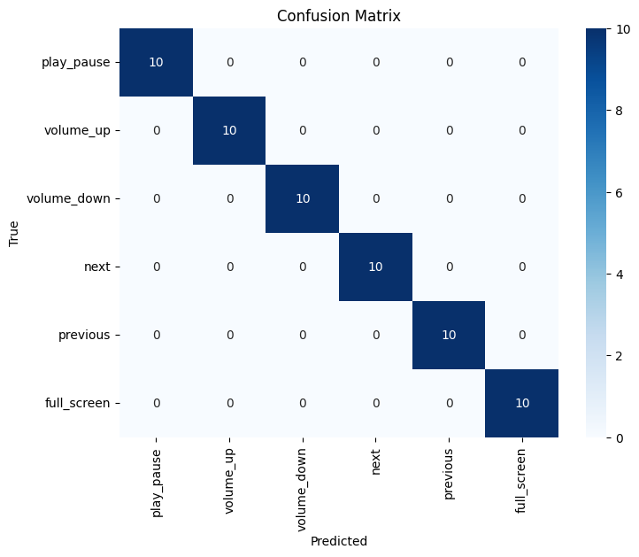

# Version 2 (v2) - Improved Model

## Description

This version represents an improved iteration of the initial model.

In this stage, the dataset has been expanded by including **left-hand gesture data**, increasing the diversity and robustness of the model.  
As a result, the dataset now contains **100 samples per class**.

Additionally, the model architecture has been optimized.  
The number of parameters has been significantly reduced from approximately **72,000 to 22,000**, making the model more efficient while maintaining performance.

### Key Improvements

- Left-hand gesture data added to the dataset  
- Dataset expanded to 100 samples per class  
- Model parameter count reduced (~72K → ~22K)  
- Improved efficiency and generalization  

---

## Açıklama

Bu versiyon, ilk modelin geliştirilmiş bir versiyonunu temsil etmektedir.

Bu aşamada veri seti, **sol el verilerinin de eklenmesiyle genişletilmiştir**.  
Böylece modelin çeşitliliği ve genelleme yeteneği artırılmıştır.  
Güncel veri seti, her sınıf için **100 örnek** içermektedir.

Ayrıca model mimarisi optimize edilmiştir.  
Parametre sayısı yaklaşık **72.000’den 22.000’e düşürülerek** model daha verimli hale getirilmiştir.

### Yapılan İyileştirmeler

- Veri setine sol el verileri eklendi  
- Her sınıf için 100 örnek olacak şekilde veri seti genişletildi  
- Model parametre sayısı azaltıldı (~72K → ~22K)  
- Verimlilik ve genelleme yeteneği artırıldı

## 📊 Results

### Accuracy

### Loss

### Confusion Matrix

