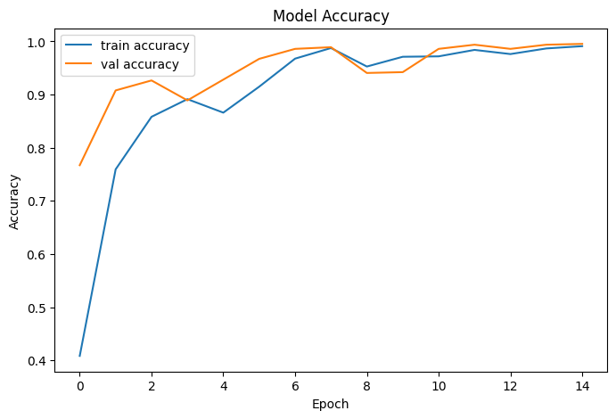
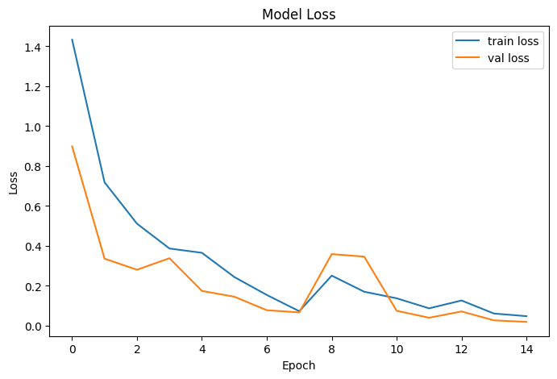
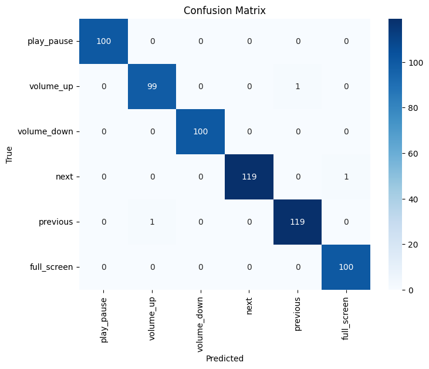

# Version 3 (v3) - Lightweight & Functional Real-Time System

## Description

This version represents a major improvement over the previous model versions.

In this stage, the dataset has been significantly expanded in order to improve the model’s robustness and real-time performance.  
The dataset size has been increased from **600 samples to 3200 samples**.

Additionally, the model architecture has been further optimized.  
The number of parameters has been reduced from approximately **22,000 to 12,000**, resulting in a lighter and faster model while maintaining strong performance.

Another major improvement in this version is the integration of the **PyAutoGUI** library.  
With this addition, the gesture recognition system became fully functional and capable of controlling media playback in real time.

### Key Improvements

- Dataset expanded (~600 → ~3200 samples)   
- Model parameter count reduced (~22K → ~12K)
- Integrated **PyAutoGUI** for media control  

---

# Açıklama

Bu versiyon, önceki model sürümlerine göre önemli geliştirmeler içermektedir.

Bu aşamada veri seti, modelin dayanıklılığını ve gerçek zamanlı performansını artırmak amacıyla büyük ölçüde genişletilmiştir.  
Veri seti boyutu **600 örnekten 3200 örneğe çıkarılmıştır**.

Ayrıca model mimarisi yeniden optimize edilmiştir.  
Parametre sayısı yaklaşık **22.000’den 12.000’e düşürülerek** model daha hafif ve daha hızlı hale getirilmiştir.

Bu sürümdeki bir diğer önemli geliştirme ise **PyAutoGUI** kütüphanesinin entegrasyonudur.  
Bu sayede gesture recognition sistemi tamamen işlevsel hale gelmiş ve gerçek zamanlı medya kontrolü yapabilmektedir.

### Yapılan İyileştirmeler

- Veri seti genişletildi (~600 → ~3200 örnek)   
- Model parametre sayısı azaltıldı (~22K → ~12K)
- Medya kontrolü için **PyAutoGUI** entegrasyonu yapıldı

---

# 📊 Results

## Accuracy

## Loss

## Confusion Matrix
